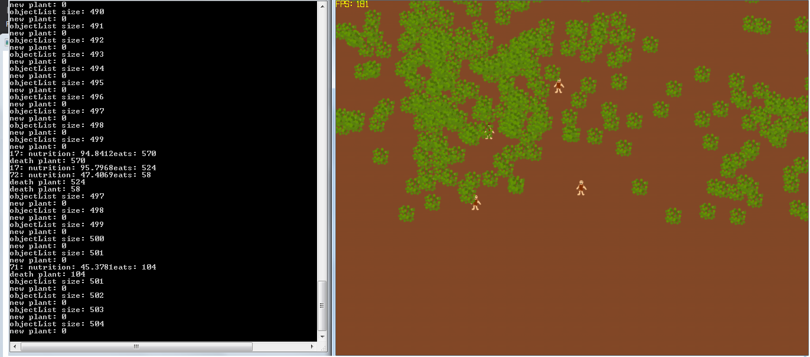

# InvasiveSpeciesCPP
C++ implementation for [InvasiveSpecies](https://github.com/yanfrimmel/InvasiveSpecies) 



## Features

* Tile based grid.
* Player avatar follows mouse press.
* Frames per seconds counter.
* Camera that follows the player in world coordinates
* Will be continued...

## How to use

### Prerequisites

This game uses SDL2, SDL_Image, and SDL_ttf, you need to have them installed in your system.

### To build on Linux

```bash
    mkdir build
    cd build
    cmake ..
    make
```

### To run

```bash
    cd build
    ./InvasiveSpeciesCPP {SCREEN_WIDTH} {SCREEN_HEIGHT} {IS_FULL_SCREEN}
